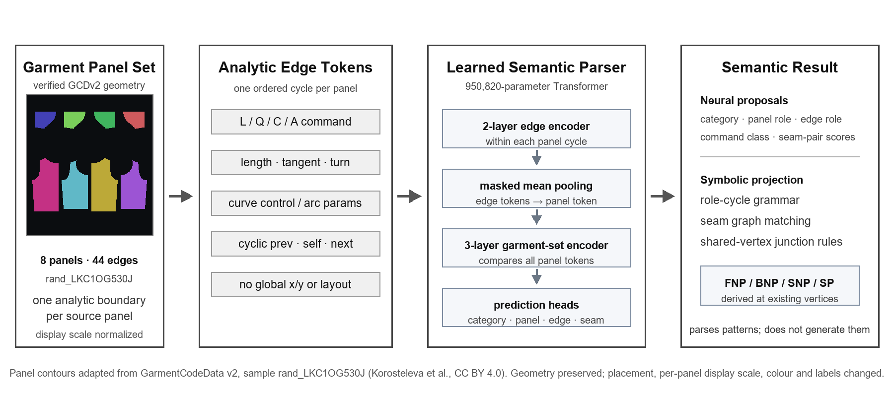

# Game Garment Benchmark - Semantic 2D Pattern Parser

This repository documents a garment inverse-design benchmark that was narrowed into a verifiable intermediate task: reading the semantic structure of completed analytic 2D sewing patterns.



The implemented parser architecture consumes the set of individual vector panels belonging to one garment during training and evaluation. Each panel is encoded as an ordered cycle of analytic line, quadratic Bezier, cubic Bezier, and circular-arc primitives in a panel-local frame. No trained parser, student, or retriever checkpoint is distributed in this public package. The parser predicts:

- garment category and panel roles;
- edge roles such as neckline, shoulder, armhole, side seam, and hem;
- FNP/SNP/SP-style landmarks derived from predicted edge-role junctions;
- candidate seam relations between panel edges.

It does **not** yet generate a production-ready pattern directly from four-view images. Four-view retrieval, semantic-coordinate transfer, parametric editing, constraint solving, and cloth simulation are reported as separate pilots or future integration work.

In plain language, the input is a completed set of separate front-bodice, back-bodice, sleeve, skirt, or trouser panels represented as vector boundaries. The output is an interpretation of what those panels and boundary segments mean. The model reads existing geometry; it does not draw new geometry.

## Main portfolio artifact

- [English technical portfolio](output/docx/semantic_pattern_bridge_portfolio_en.docx)
- [English system schematic](reports/figures/pattern_semantic_parser_schematic_en.png)
- [English analytic-DSL example](reports/figures/pattern_dsl_semantic_example_en.png)
- [Verified GitHub publication guide](GITHUB_UPLOAD_GUIDE.md)

## Evidence summary

The canonical parser was trained on a 1,983-pattern top/skirt/pants subset derived from one official GarmentCodeData v2 batch. The split is sample-ID disjoint but remains within the same GarmentCode generator.

On 198 frozen-test garments:

- garment-category accuracy: `1.000`;
- panel-role macro-F1: `0.930`;
- raw edge-role macro-F1: `0.942`;
- post-projection role-junction landmark F1: `0.928`;
- post-projection symbolic seam F1: `0.593`.

A separate visual-to-DSL retriever increased coverage of a target-matching primitive-cycle topology signature at rank 10 from `36.36%` to `46.46%` on the fixed split, while rank-1 changed only from `14.65%` to `15.66%`. This broadens a candidate set; it does not solve target-pattern selection. The comparison uses a parameter-free raw-FPN nearest-neighbour baseline and a trained dual encoder; it is not an architecture-matched ablation.

A distinct 128-query four-view student reduced normalized 2D semantic-coordinate MAE by `7.98%` relative to a train-only category-mean baseline on 78 same-generator held-out garments. This lane uses a different ontology and checkpoint and is not yet integrated with the canonical parser/retriever.

## Repository structure

```text
benchmark/       model, preprocessing, training, evaluation, and test code
data/manifests/  lightweight data contracts, splits, provenance, and metrics
reports/figures/ project-generated public figures
output/docx/     final portfolio document
```

Datasets, source images, external repositories, checkpoints, caches, local environments, and large runtime artifacts are intentionally excluded from the public package.

## Reproducibility boundary

This public release is a source-and-evidence snapshot, not a self-contained model release. It includes project code, compact manifests, reported metrics, figures, and the final portfolio, but no trained checkpoints, source vector-pattern records, raw or processed images, external repositories, or third-party model weights.

A visitor can inspect the implementation, verify the release manifest, and rebuild the portfolio document. The reported training and evaluation numbers cannot be independently reproduced, and ready-made inference cannot be run, from this ZIP alone.

Full reproduction requires separately obtaining GarmentCodeData v2 and any referenced upstream repositories or weights under their respective licenses, recreating the recorded environments, and retraining the project checkpoints. Included manifests are evidence summaries and contracts, not substitute datasets or weights.

## Rebuild the English portfolio

The document builder requires Python 3.10+, Pillow 12.3.0, python-docx 1.2.0, and the Arial font files currently referenced from `C:\Windows\Fonts`. LibreOffice and Poppler are additionally required for rendered-page visual QA. The current builder is Windows-oriented unless the font paths are changed.

From the project root:

```powershell
python -m pip install ".[report]"
python benchmark/scripts/build_portfolio_technical_report_docx.py
```

The builder writes `output/docx/semantic_pattern_bridge_portfolio_en.docx` and regenerates the two English figures listed above. A local LibreOffice/Poppler setup is required only for rendering the DOCX to page images for visual QA.

## Build the public GitHub ZIP

Run the non-writing validation first:

```powershell
python -m benchmark.scripts.build_github_release_zip --check-only
```

Then build the archive:

```powershell
python -m benchmark.scripts.build_github_release_zip
```

The default output is `output/releases/game-garment-benchmark-public.zip`. It contains a `game-garment-benchmark/` root and a `RELEASE_MANIFEST.sha256.json` file with the byte size and SHA-256 digest of every included file.

## Claim boundary

The present evidence supports same-generator parsing of GCDv2-derived weak semantic labels and limited component-level visual transfer. It does not establish:

- expert-grade industrial drafting semantics;
- recipe-family, body, generator, or cross-source generalization;
- end-to-end four-view-to-pattern generation;
- complete seam-graph recovery;
- CAD validity, fit, sewability, manufacturability, or simulation readiness;
- superiority to ReWeaver, Garment Particles, or other image-to-pattern systems.

## Data use and licensing

This repository currently grants no blanket open-source license for project-authored material. See `LICENSE_NOTICE.md` for the project-level rights notice and `THIRD_PARTY_NOTICES.md` for upstream attribution, license terms, modifications, and exclusions.

GarmentCodeData v2 is attributed under CC BY 4.0. The public ZIP excludes original dataset archives, renders, meshes, third-party weights, downloaded source trees, restricted/private-evaluation data, live storage links, and granular sample materials derived from non-commercial or share-alike sources. Technical benchmark success does not grant permission to redistribute or publicly display source data.
