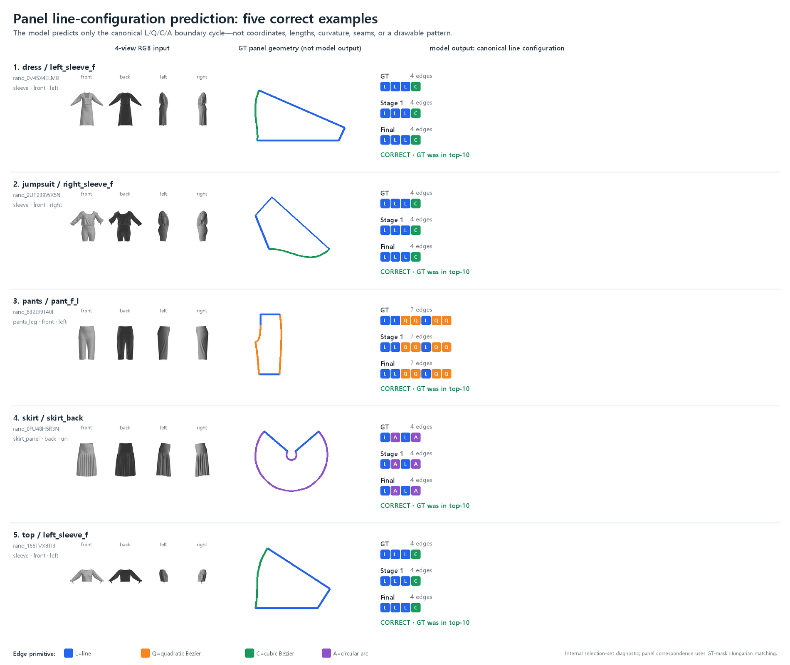

# 4-view RGB → 구조화된 sewing pattern 연구 스냅샷

중성 4-view 의상 이미지에서 편집 가능한 2D sewing pattern을 예측하기 위해 진행한 내부 연구를 공개 가능한 범위로 정리한 보고서 디렉터리입니다. 저장소의 pattern semantics 연구를 확장하지만, 아직 하나로 연결된 end-to-end 시스템은 아닙니다.

## 현재 결과

- GarmentCodeData v2 로컬 3,450벌을 **13,800장의 4-view RGB**와 round-trip 검사를 거친 analytic pattern 표현으로 연결했습니다.
- 2,995벌·11,980 view에 대해 pixel-aligned visible-panel mask를 생성했습니다.
- 패널 사이를 두꺼운 ignore 영역으로 버리던 정답 정책을 고치고 ViT를 다시 학습했습니다.
- 동일한 내부 패널 2,027개에서 line-configuration top-1은 **50.27% → 52.74%**, top-10 reranker 최종 top-1은 **56.64% → 58.95%**로 개선됐습니다.

현재 결과는 완성 패턴 복원이 아닙니다. 최신 모델이 맞힌 것은 GT와 대응된 visible panel의 **경계 수와 canonical L/Q/C/A 구성**입니다. 길이, 각도, 곡률, 제어점, 봉제 관계 및 실제 2D 도면은 아직 예측하지 못했습니다.



## 문서

- [전체 한국어 연구 보고서](RESEARCH_REPORT_KO.md)
- [결과를 주장할 수 있는 범위](CLAIM_BOUNDARY_KO.md)
- [다음 실험: source-edge-aware pretraining](FUTURE_WORK_LINE_MASK_PRETRAINING_KO.md)
- [그림의 출처와 해석 범위](FIGURE_PROVENANCE.md)
- [집계 결과 JSON](../../data/manifests/rgb_pattern_prediction/summary_metrics.json)

## 빠른 검사

```bash
python -m pytest -q benchmark/tests/test_rgb_pattern_signature_utils.py
python -m benchmark.scripts.build_github_release_zip --check-only
```

원본 GCDv2 archive, 전체 RGB·mask, mesh, checkpoint, feature cache 및 로컬 실행 기록은 포함하지 않았습니다. 대표 그림은 GCDv2 CC BY 4.0 자료에서 파생했으며 출처와 변경 내용을 명시했습니다.
