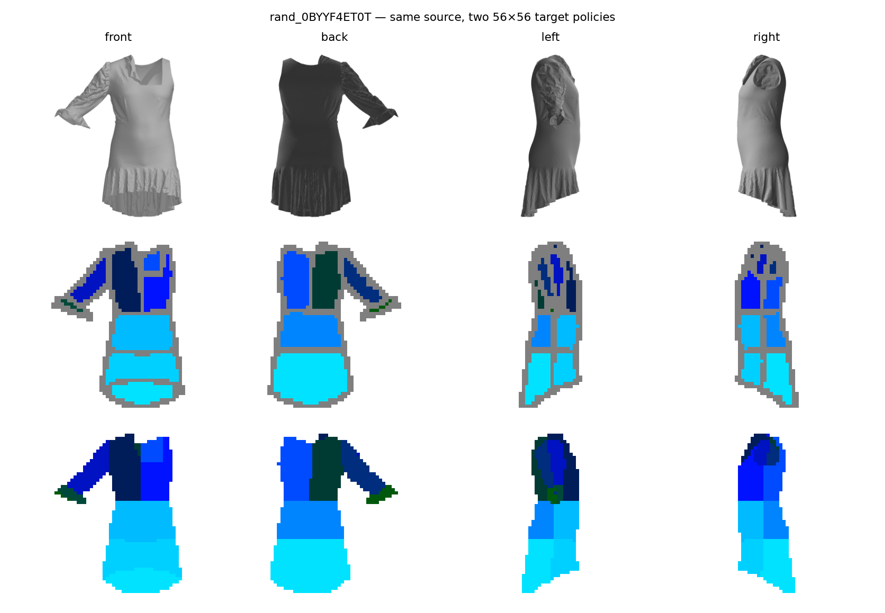
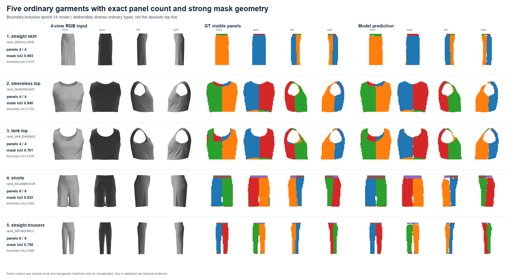
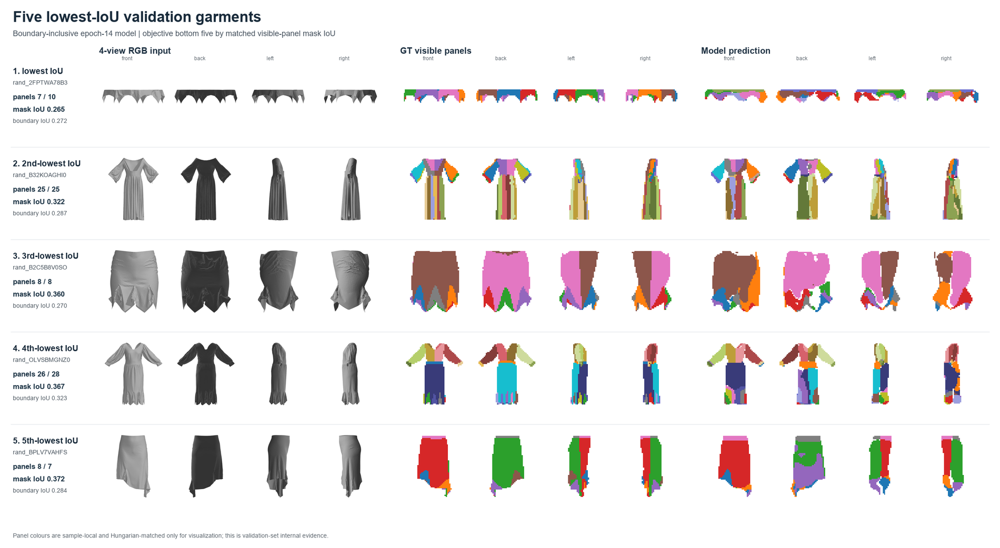
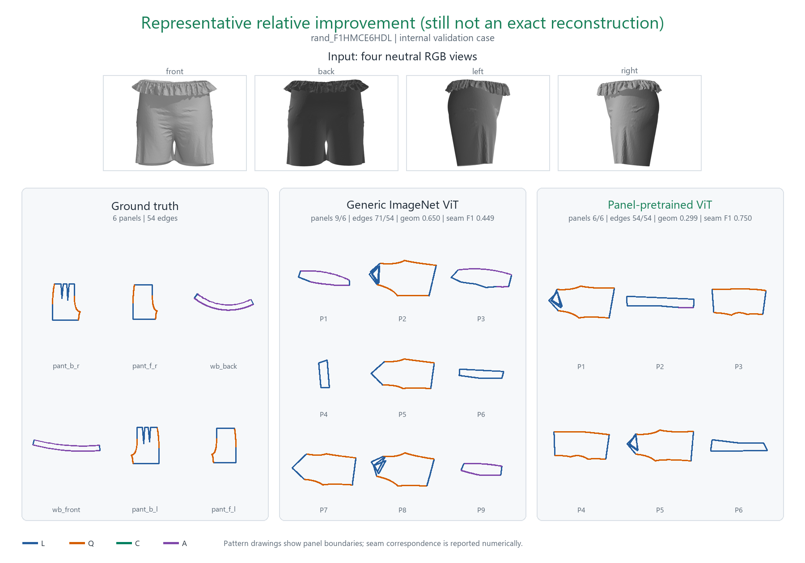
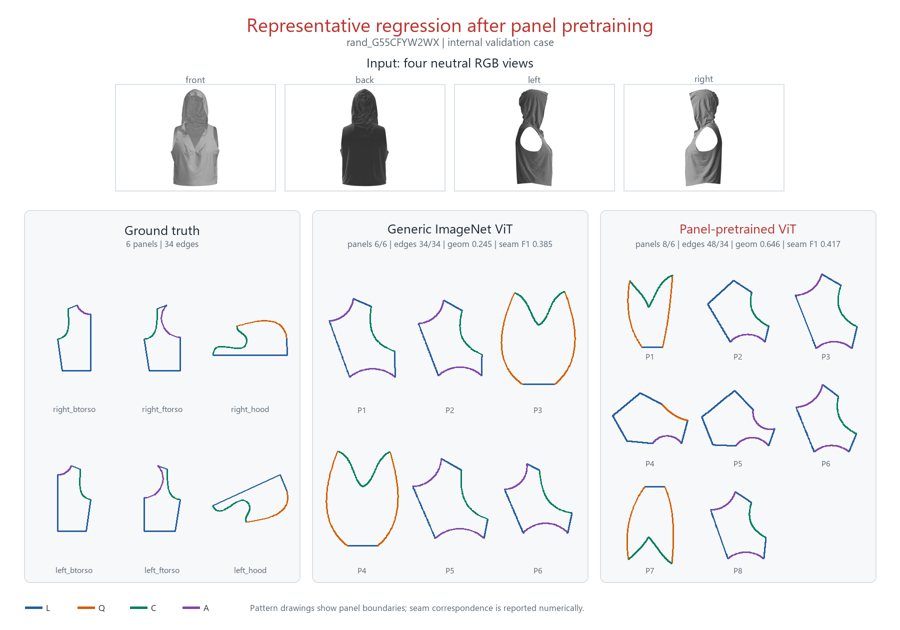
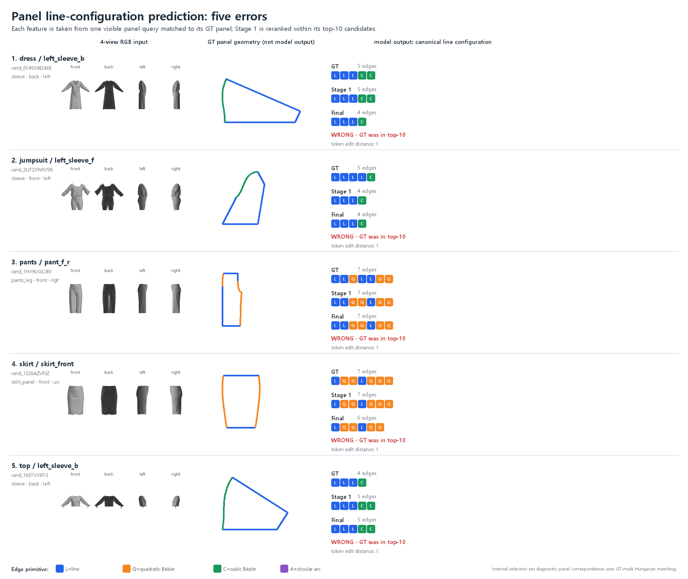

# 4-view RGB에서 구조화된 sewing pattern을 예측하기 위한 단계별 연구 보고서

작성 기준일: 2026-09-07  
상태: 내부 POC와 병목 진단 단계  
평가 범위: 합성 GarmentCodeData v2의 고정 개발 분할과 내부 selection  
공식 test 및 실제 사진 평가: 수행하지 않음

## 1. 한 문장 결론

3D로 착장된 의상의 중성 4-view 이미지와 원본 2D 패턴을 연결한 데이터 파이프라인을 구축하고, 패널 영역 학습·전체 패턴 생성·순서 불변 구조 예측·패널별 검색을 차례로 비교했다. 완성 패턴의 자율 복원에는 아직 실패했지만, 패널 경계를 채점에서 제외하던 정답 정책을 고친 뒤 동일한 내부 패널 2,027개에서 line-configuration 최종 top-1을 **56.64%에서 58.95%로 개선**했고, 다음 병목을 개별 source edge의 위치·분할점·연속 기하로 좁혔다.

## 2. 무엇을 입력받고 무엇을 맞히려 했나

최종 목표는 사진과 닮은 패턴 그림을 출력하는 것이 아니다. 다시 편집하고 봉제 관계를 검사할 수 있는 구조화된 패턴을 출력하는 것이다.

```text
front / back / left / right RGB
  → 어떤 패널들이 있는가
  → 각 패널의 닫힌 경계는 몇 구간인가
  → 각 구간은 L/Q/C/A 중 무엇인가
  → 각 선의 길이·방향·곡선 파라미터는 얼마인가
  → 어떤 경계끼리 봉제되는가
```

- `L`: line
- `Q`: quadratic Bézier
- `C`: cubic Bézier
- `A`: circular arc

패널의 전역 나열 순서는 의미가 없다. 패널 한 장 안에서는 경계들이 윤곽을 따라 순환한다는 관계가 중요하다. 봉제는 두 경계를 잇는 graph 관계로 본다.

현재 최신 결과가 해결한 것은 이 전체 문제 중 **보이는 패널의 영역**과 **한 패널의 경계 수 및 L/Q/C/A 순환 구성**까지다. 실제 선의 길이·각도·제어점·봉제 관계와 완전한 2D 도면은 아직 해결하지 못했다.

## 3. 연구가 어떤 근거로 다음 단계로 넘어갔나

| 단계 | 확인하려던 질문 | 실행 | 관찰 | 다음 결정 |
|---|---|---|---|---|
| paired corpus | RGB와 pattern 정답이 정말 같은 의상인가 | 3,450벌의 4-view RGB, 원본 JSON, analytic DSL, 복원 JSON을 ID로 연결 | 13,800 RGB와 round-trip 검사를 갖춘 corpus 확보 | RGB에서 패널을 구분하는 supervision 생성 |
| panel-mask pretraining | 일반 ImageNet 특징이 의상 패널 경계를 충분히 담는가 | pixel-aligned visible-panel mask로 ViT를 추가 학습 | 패널 영역 자체는 학습됨 | 전체 패턴 예측으로 전이되는지 검사 |
| AR 전체 생성 | 명령을 순서대로 생성하면 가변 topology를 풀 수 있는가 | `PANEL/L/Q/C/A/SEAM/END`와 수치를 autoregressive 생성 | 두 encoder 모두 valid pattern 0/173 | 임의 순서와 누적 오차를 제거 |
| set/cycle/graph | 패널 순서와 exposure bias가 주원인인가 | panel=set, boundary=cycle, seam=graph | count는 개선됐으나 geometry·seam 이득은 작음 | 무에서 생성하지 말고 유효한 패널을 검색 |
| oracle panel bank | 시작점으로 쓸 구조가 bank에 실제 존재하는가 | train-only 및 생성 패널 bank의 정답 기준 coverage 계산 | validation 패널 구조 99.89% covered | bank 부족보다 이미지 기반 선택 문제에 집중 |
| essential geometry retrieval | 구조와 연속 기하를 한 번에 검색할 수 있는가 | 가변 길이 기하 sequence와 visual feature를 정렬 | near-geometry Recall@5 0.99% | target을 line 구성으로 축소 |
| line classifier | 이미지에서 경계 수와 L/Q/C/A cycle은 구별 가능한가 | 346-class 분류 | 최신 top-1 52.74%, top-10 93.04% | top-10 안에서 후보를 다시 비교 |
| reranker | 열 후보 중 하나를 더 잘 고를 수 있는가 | image query와 candidate sequence를 함께 비교 | 최신 top-1 58.95% | 한두 경계 차이를 직접 감독할 source-edge mask가 필요 |
| mask-policy audit | 두꺼운 회색 ignore 영역이 경계 학습을 막았는가 | 패널 사이 ignore를 없애고 majority-ID target으로 재학습 | boundary IoU와 downstream line 분류가 함께 개선 | panel mask 다음에 line-aware supervision을 추가 |

핵심은 모델을 임의로 계속 덧붙인 것이 아니라, 매 단계에서 **데이터 정합성, 시각 표현, 생성 방식, bank coverage, 후보 구별 능력**을 분리해 확인했다는 점이다.

## 4. 데이터와 정답 표현

### 4.1 3,450벌의 paired corpus

로컬 GarmentCodeData v2 subset의 기존 simulation mesh를 Blender 4.5.12에서 정사영으로 렌더했다. 새 cloth simulation은 수행하지 않았고, panel color나 texture가 단서가 되지 않도록 중성 회색으로 만들었다.

| 항목 | 수량 또는 형식 |
|---|---:|
| 의상 | 3,450벌 |
| RGB | 4 view × 3,450 = 13,800장 |
| 해상도 | 384×384 RGB |
| 패널 | 37,031개 |
| 경계 | 251,335개 |
| 봉제 항목 | 104,064개 |
| L / Q / C / A | 190,505 / 22,191 / 17,260 / 21,379 |

고정 분할은 training 2,615, validation 173, test 165, unassigned 497이다. training 안의 exact pattern duplicate 2건을 downstream train에서 제외해 effective train은 2,613벌이다.

### 4.2 원본 패턴을 다시 그릴 수 있는가

각 sample에 다음 자료를 연결했다.

- 원본 pattern JSON
- panel-local analytic DSL
- DSL decoder로 다시 만든 pattern JSON
- source ↔ reconstructed panel/edge 대응표
- source/reconstructed SVG
- 4-view RGB와 카메라 기록
- 기하 및 파일 무결성 기록

round-trip 검사에서는 끝점, 곡선 중간 257개 지점, curve parameter, panel closure, edge partition, sewing reference를 비교했다. 이 검사는 **수학적 표현이 원본 패턴 기하를 잃지 않았는지**를 확인한다.

이 통과는 다음을 보장하지 않는다.

- 실제 봉제 가능성
- 사람 몸에 맞는 핏
- 패널 자기교차 없음
- CLO simulation 성공
- 모델이 그 표현을 이미지에서 예측할 수 있음

### 4.3 pixel-aligned visible-panel mask

동일한 mesh와 카메라로 panel instance ID를 렌더하고 원본 panel ID에 연결했다.

| 상태 | 수량 |
|---|---:|
| 목표 의상 | 3,450 |
| 검사 통과 의상 | 2,995 |
| 통과 view | 11,980 |
| 제외 또는 실패 | 455 |
| 미처리 | 0 |

mask의 색과 숫자는 sample-local instance ID다. 서로 다른 의상의 같은 색이 같은 패널 역할을 뜻하지 않는다. 가려진 패널을 보이는 것처럼 억지로 채점하지 않고 view별 visibility를 사용한다.

## 5. 패널 마스크 정답 정책을 왜 다시 고쳤나

### 5.1 과거 회색 띠의 의미

과거 target은 서로 다른 패널이 맞닿는 경계와 그 주변을 회색 `ignore`로 만들었다. 원본 384×384에서 작은 ignore가 생기면 56×56로 줄이는 과정에서 해당 cell 전체를 버렸기 때문에, 시각화에서는 패널 사이에 두꺼운 회색 선이 나타났다.

그 회색 선은 RGB 입력도, 봉제선도, 모델 예측도 아니었다. **loss와 IoU에서 채점하지 않은 영역**이었다. 결과적으로 패널 면적은 배우면서도, 사용자가 중요하다고 지적한 패널 사이 경계를 직접 학습하지 않는 문제가 생겼다.

### 5.2 새 boundary-inclusive target

모델·초기 pretrained weight·split·optimizer·seed는 유지하고 정답 생성 정책만 바꿨다.

1. 패널과 패널 사이에는 ignore 띠를 만들지 않는다.
2. 옷과 배경 사이에서는 실제 anti-aliasing이 애매한 외곽 픽셀만 제외한다.
3. 384→56 축소 시 ignore dilation과 보수적 `all-valid` 규칙을 제거한다.
4. 각 56×56 cell은 그 안의 유효 원본 픽셀에서 가장 많은 panel ID를 정답으로 사용한다.
5. 동률은 cell 중심과 가까운 픽셀, 그다음 낮은 numeric ID 순으로 결정한다.



위 그림은 같은 source의 RGB, 과거 target, 새 target을 위에서 아래 순서로 비교한다. 새 target에서는 패널 사이 회색 띠가 사라지고 경계 cell에도 어느 쪽 패널인지 정답이 남는다.

## 6. Experiment A — boundary-inclusive panel-mask pretraining

### 6.1 실행 범위

- 입력: 동일 garment의 front/back/left/right RGB
- 시작점: torchvision ViT-B/16 pretrained weights
- gradient train: 2,259 garments
- checkpoint selection: 154 garments
- seed: 17
- 최대 20 epoch, patience 5
- 종료: epoch 19 early stopping
- 선택 checkpoint: epoch 14
- official test 사용: 없음

이 split은 과거 탐색용 split을 그대로 사용했기 때문에 downstream의 독립 최종 평가로 간주하지 않는다. 목적은 **target 정책 하나만 바꾼 직접 A/B**다.

### 6.2 동일한 새 정답으로 옛 모델과 새 모델 비교

| 지표 | 옛 epoch-9 encoder | 새 epoch-14 encoder | 변화 |
|---|---:|---:|---:|
| 전체 matched-panel IoU | 0.6003 | **0.6813** | +0.0810 |
| 패널 사이 boundary-band IoU | 0.4475 | **0.5212** | +0.0737 |
| 옷 외곽 boundary-band IoU | 0.4924 | **0.6474** | +0.1550 |
| panel-count MAE | **1.5584** | 1.7727 | +0.2143, 악화 |

과거 보고된 IoU 약 0.86은 회색 ignore가 포함된 더 쉬운 옛 정답으로 계산했으므로 위 표와 직접 비교하면 안 된다. 위 표는 두 checkpoint를 모두 **같은 새 정답**에서 다시 평가한 결과다.

결과는 한 방향으로만 좋아지지 않았다. 경계와 전체 mask IoU는 개선됐지만 패널 수 오차는 악화됐다. 따라서 새 모델은 `모든 panel 관련 지표에서 우수하다`가 아니라 **경계 cell을 포함한 mask geometry가 더 정확하다**고 해석해야 한다.

### 6.3 실제 예시



이 다섯 사례는 직선 치마, 민소매 상의, 탱크톱, 반바지, 기본형 바지 중 panel count가 정확하고 mask IoU가 상대적으로 높은 내부 selection 사례다. 결과를 본 뒤 선택한 정성적 예시이며 독립 test 증거가 아니다.



최저 IoU 사례에서는 얇은 패널, 겹침, 다수의 작은 패널, 복잡한 silhouette가 남은 오류와 함께 나타난다. 패널 수를 맞혀도 영역 대응이 틀릴 수 있고, 반대로 전체 silhouette가 비슷해도 패널을 과다·과소 분할할 수 있다.

## 7. Experiment B — 전체 패턴을 무에서 생성하려 한 모델

### 7.1 autoregressive baseline

초기 baseline은 정면 RGB 한 장을 frozen ViT로 읽고 Transformer decoder가 `PANEL/L/Q/C/A/SEAM/END` 명령과 연속 기하 수치를 차례로 생성했다. 이 단계는 4-view가 아니라 **front-only**였다.

validation 173벌, seed 17 결과:

| 지표 | generic ViT | historical panel-pretrained ViT |
|---|---:|---:|
| teacher command accuracy | **0.9320** | 0.9288 |
| numeric MAE | **0.2461** | 0.2476 |
| panel-count MAE | 2.6590 | **2.5202** |
| edge-count MAE | 16.4046 | **14.4162** |
| 평균 최대 closure gap | 52.3205 cm | **47.7303 cm** |
| seam macro-F1 | **0.1056** | 0.0979 |
| valid pattern rate | 0% | 0% |

teacher forcing에서 다음 token을 맞히는 것과 모델이 처음부터 끝까지 스스로 생성하는 것은 달랐다. 앞의 작은 오류가 뒤의 패널 수·경계 수·기하·봉제에 누적됐고, 두 모델 모두 모든 패널을 닫는 데 실패했다.

### 7.2 panel set / boundary cycle / seam graph

AR의 임의 패널 순서와 누적 오류를 줄이기 위해 다음처럼 바꿨다.

- 패널: 순서 없는 set
- 패널 내부: 시작 edge 이동과 전체 reversal에 불변인 cycle
- 봉제: 순서 없는 graph edge set
- closure: by construction

동일한 front-only validation 173벌, seed 17 결과:

| 지표 | generic ViT | historical panel-pretrained ViT |
|---|---:|---:|
| panel-count MAE | 2.9133 | **2.5549** |
| edge-count MAE | 20.0751 | **17.9827** |
| panel+edge count 동시 일치 | 2.89% | **6.94%** |
| L/Q/C/A accuracy | 48.80% | **49.41%** |
| scale-normalized geometry error | 0.9752 | **0.9664** |
| quotient seam macro-F1 | 0.2274 | **0.2355** |

closure-by-construction으로 형식상 닫힌 패널은 만들 수 있었지만, 정확한 line type·geometry·seam 개선은 작았다.





이 단계로 `패널이 안 닫히는 이유가 AR뿐이다`라는 가설은 기각됐다. 더 작은 데이터에서 가변 topology와 모든 연속 수치를 무에서 동시에 생성하는 문제 자체가 어려웠다.

## 8. Experiment C — 패널별 retrieval로 문제 분해

### 8.1 왜 한 벌이 아니라 패널별로 검색했나

새 의상이 training bank의 어느 한 벌과 완전히 같을 필요는 없다. 목표 의상의 앞몸판은 A 의상, 소매는 B 의상, 허리밴드는 C 의상에서 각각 가까운 출발점을 가져올 수 있다. 따라서 target panel 수가 같은 한 벌을 찾는 제약을 제거했다.

| bank | garments | panels | edges |
|---|---:|---:|---:|
| effective train | 2,613 | 27,098 | 186,935 |
| RGB 없이 생성한 extension | 10,000 | 102,210 | 705,599 |
| 합계 | 12,613 | 129,308 | 892,534 |

정답 구조를 알고 검색한 oracle에서는 validation panel 1,763개 중 1,761개, 즉 **99.89%**가 같은 canonical L/Q/C/A cycle의 후보를 찾았다. 173벌 중 모든 패널이 covered된 의상은 171벌, **98.84%**였다.

이 결과는 `bank에 출발점이 존재한다`는 뜻일 뿐, 이미지에서 올바른 후보를 찾았다는 뜻이 아니다.

### 8.2 연속 기하까지 한 번에 찾으려 한 v4.1

패널 크기, 가변 길이 edge sequence, L/Q/C/A, normalized vertex, active control, arc parameter를 함께 정렬했을 때 structure hit@5는 41.44%, near-geometry Recall@5는 **0.99%**였다.

가까운 후보는 bank에 있었지만, visual query 하나에서 구조 선택과 정확한 길이·각도·제어점을 동시에 찾는 학습은 되지 않았다. 그래서 먼저 이미지로 판별 가능한 최소 단위인 line configuration만 분리했다.

## 9. Experiment D — 패널 line configuration 분류와 재선택

### 9.1 무엇을 예측했나

한 패널의 경계 수와 L/Q/C/A 순환 구성을 하나의 class로 정의했다. 시작 edge의 위치와 시계·반시계 방향이 바뀌어도 같은 구조로 canonicalize했다.

예를 들어 `4:LLLC`는 다음만 뜻한다.

- 경계 4개
- 직선 3개
- cubic Bézier 1개

다음은 예측하지 않았다.

- 각 선의 실제 길이와 각도
- 곡선 제어점과 반지름
- 패널의 실제 2D 좌표
- edge semantic role
- 봉제 상대

따라서 이 단계의 출력만으로는 패널 도면을 새로 그릴 수 없다.

### 9.2 평가 단위의 중요한 제한

mask model의 query와 실제 source panel을 **GT mask 기준 Hungarian matching**으로 먼저 대응시킨 다음, 해당 query의 192-D feature에서 line configuration을 예측했다.

즉 다음을 평가한 것이다.

```text
GT와 대응된 visible-panel query
  → 이 패널의 canonical L/Q/C/A 구성은 무엇인가
```

다음 end-to-end 성공률을 평가한 것은 아니다.

```text
새로운 RGB
  → 패널 대응
  → 모든 패널의 실제 선 좌표
  → seam graph
  → 완성 2D pattern
```

### 9.3 옛 encoder와 boundary-inclusive encoder의 공정 비교

새 target 정책에서는 작은 패널이 더 많이 살아났다. 데이터 수 증가 효과를 encoder 효과로 오해하지 않도록, 옛 cache의 **동일 sample·동일 source panel·동일 순서·동일 label** 17,744 train panels / 2,027 selection panels를 고정하고 feature만 교체했다.

#### 1차 346-class line-configuration classifier

| 지표 | 옛 encoder | 새 boundary-inclusive encoder | 변화 |
|---|---:|---:|---:|
| top-1 | 50.27% | **52.74%** | +2.47%p |
| top-5 | 85.79% | **86.58%** | +0.79%p |
| present-class macro recall | 20.01% | **23.97%** | +3.97%p |

분류기는 `LayerNorm(192) → Linear(192,256) → GELU → Dropout → Linear(256,346)`의 작은 MLP다.

#### top-10 candidate-conditioned reranker

| 지표 | 옛 encoder | 새 boundary-inclusive encoder | 변화 |
|---|---:|---:|---:|
| stage-1 top-1 | 50.27% | **52.74%** | +2.47%p |
| 정답이 top-10에 존재 | 92.25% | **93.04%** | +0.79%p |
| 최종 top-1 | 56.64% | **58.95%** | +2.32%p |
| top-10 covered 조건부 정확도 | 61.39% | **63.36%** | +1.97%p |

reranker는 image-panel query, 후보의 가변 L/Q/C/A sequence를 읽는 bidirectional GRU, stage-1 score와 rank를 함께 비교한다. 최신 모델은 stage-1 오류 270개를 복구했지만 이미 맞은 144개를 망가뜨려 순증은 126개였다.


가운데 패널 윤곽은 모델 출력이 아니라 실제 GT geometry다. 색은 각 GT edge의 primitive type을 뜻하고, 모델 출력은 오른쪽 `Stage 1`과 `Final`의 L/Q/C/A sequence다.



오류 그림에는 `5:LLLCC ↔ 4:LLLC`, `7:LLQLLQQ ↔ 7:LLQQLQQ`처럼 한 구간의 존재나 종류만 다른 사례가 포함된다.

### 9.4 최신 오류 통계

| 항목 | 값 |
|---|---:|
| selection panels | 2,027 |
| top-10에 정답 존재 | 1,886 |
| 최종 정답 | 1,195 |
| 정답이 top-10에 있는데도 실패 | 691 |
| covered error 중 edit distance ≤2 | 398 / 691 = 57.60% |
| covered error 중 edge count가 같거나 ±1 | 504 / 691 = 72.94% |

최다 혼동은 `4:LALA → 4:LLLL` 44건이었다. 그다음에는 `4:LLLC → 5:LLLCC` 29건, `4:LLLL → 4:LLLA` 21건이 있었다.

이는 panel-area supervision만으로는 다음을 충분히 배우지 못한다는 근거다.

- 윤곽의 어느 지점에서 source edge가 나뉘는가
- 짧은 구간이 직선인지 곡선인지
- 하나의 곡선을 한 구간으로 볼지 둘로 나눌지

## 10. 지금까지 확인된 것과 확인되지 않은 것

### 확인된 진전

- 3,450벌의 4-view RGB와 복원 가능한 analytic pattern을 같은 sample ID로 연결했다.
- 2,995벌·11,980 view의 pixel-aligned visible-panel mask를 생성했다.
- 회색 ignore 정책의 문제를 찾아 같은 target에서 mask와 boundary IoU가 좋아지는 수정안을 검증했다.
- panel set / boundary cycle / seam graph 표현을 구현해 임의 패널 순서와 closure 문제를 분리했다.
- train-only panel bank가 validation line structure의 99.89%를 oracle 기준으로 포함함을 확인했다.
- 같은 2,027개 패널에서 새 encoder가 line classifier와 reranker를 소폭이지만 일관되게 개선했다.
- 오류가 단순 후보 부재보다 한두 source edge의 분할과 primitive type 구별에 집중됨을 정량화했다.

### 아직 주장할 수 없는 것

- RGB에서 완성된 2D sewing pattern을 복원했다는 주장
- line configuration 결과가 실제 선 좌표·길이·곡률을 맞혔다는 주장
- hidden panel geometry를 정확히 추론했다는 주장
- seam graph 정확도나 실제 봉제 가능성
- CLO simulation 및 fit 성공
- 실제 사진 또는 다른 생성기의 패턴으로 일반화
- 여러 seed와 untouched official test에서 재현된 최종 성능

## 11. 다음 실험

다음 단계는 현재 panel mask를 버리는 것이 아니라, 같은 계층에 **source-edge mask/centerline과 endpoint heatmap**을 추가하는 line-aware pretraining이다.

```text
4-view neutral RGB
  ↓
ImageNet ViT
  ↓
dense visual tokens
  ├── panel queries → panel mask / visibility
  └── panel-conditioned edge queries
        ├── visible source-edge mask 또는 centerline
        ├── endpoint heatmap
        ├── edge visibility
        └── optional L/Q/C/A head
```

새 실험은 다음 세 encoder를 같은 downstream 모델과 동일 population에서 비교해야 한다.

| Arm | Encoder |
|---|---|
| A | generic ImageNet ViT |
| B | clean train-only panel-mask-pretrained ViT |
| C | 같은 split의 panel+source-edge-pretrained ViT |

현재 latest 결과도 single seed 내부 selection이므로, 다음 단계에서는 checkpoint selection과 downstream validation을 분리한 clean train-only split을 먼저 고정한다. seed 17에서 사전등록 gate를 통과할 때만 공통 seed를 추가하고, 그 뒤에만 untouched test 165벌을 평가한다.

## 12. 최종 해석

현재 가장 정확한 설명은 다음과 같다.

> 4-view garment render와 analytic sewing-pattern graph를 연결한 데이터를 구축하고, 패널 영역 사전학습·전체 생성·순서 불변 구조 예측·패널별 검색을 비교했다. 직접 패턴 생성은 실패했지만, 패널 경계를 supervision에 포함하자 mask boundary와 패널 line-configuration 선택이 함께 개선됐다. 현재 남은 핵심은 각 visible panel의 source-edge 분할점과 연속 geometry를 이미지에 연결하는 것이다.

이 연구의 가치는 완성 시스템을 주장하는 데 있지 않다. 어떤 부분이 데이터 문제였고, 어떤 부분이 생성 구조 문제였으며, 현재 어떤 최소 과제까지 학습 가능한지를 실제 실패와 공정 A/B로 좁힌 데 있다.
